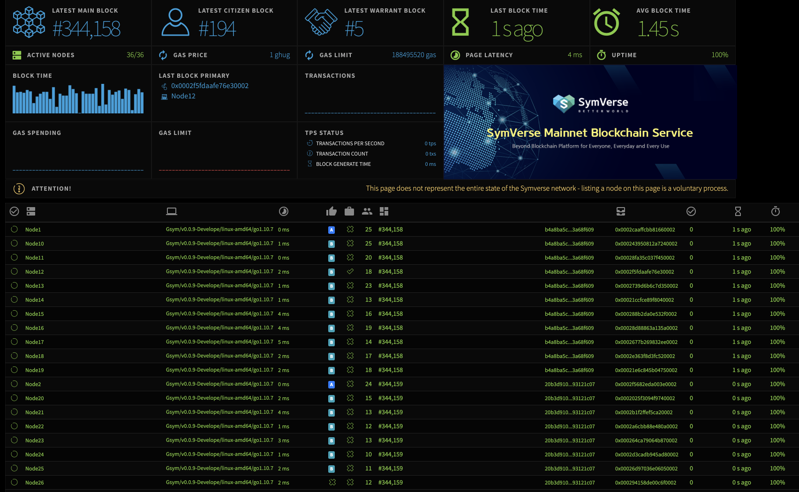

Symverse Network DashBoard
============

This is a visual interface for tracking symverse network status. It uses WebSockets to receive stats from running nodes and output them through an angular interface.

Symverse Network DashBoard is based on [eth-netstats](https://github.com/cubedro/eth-netstats).



## Prerequisite
* node
* npm

## Installation
Make sure you have node.js and npm installed.

Clone the repository and install the dependencies

```bash
git clone https://github.com/symverse-lab/sym-netstats.git
cd symstats
npm install
sudo npm install -g grunt-cli
```

##Build the resources
NetStats features two versions: the full version and the lite version. In order to build the static files you have to run grunt tasks which will generate dist or dist-lite directories containing the js and css files, fonts and images.


To build the full version run
```bash
grunt
```


##Run

```bash
npm start
```

see the interface at http://localhost:3000

